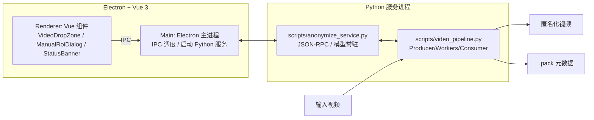
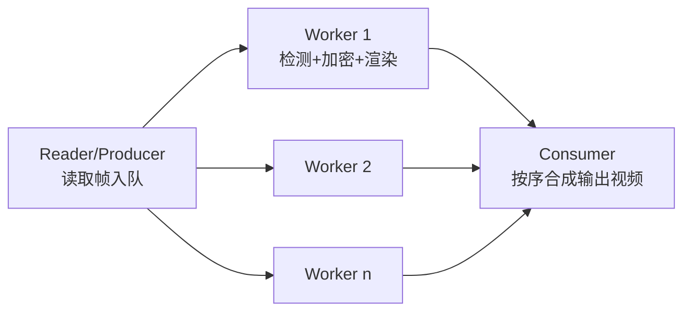
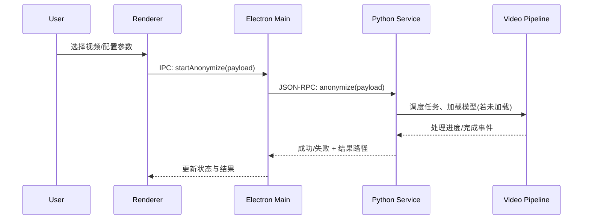
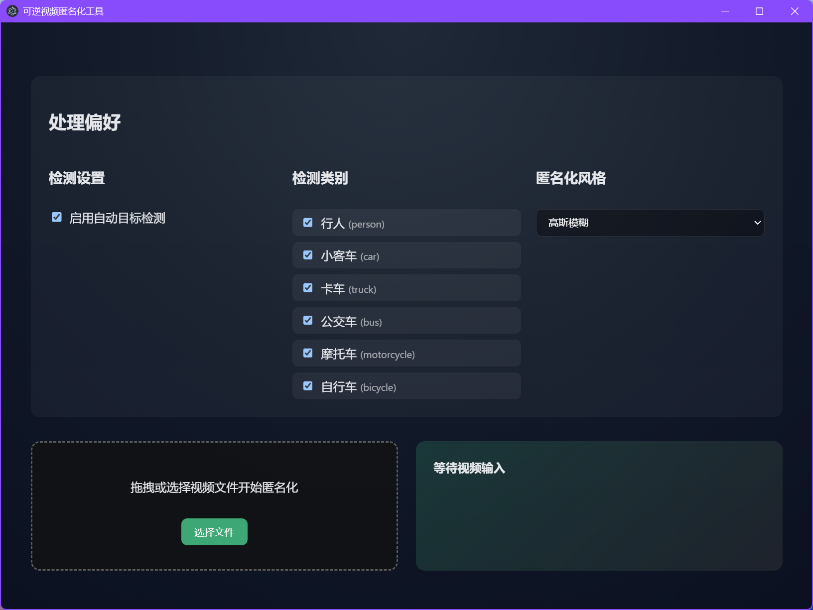
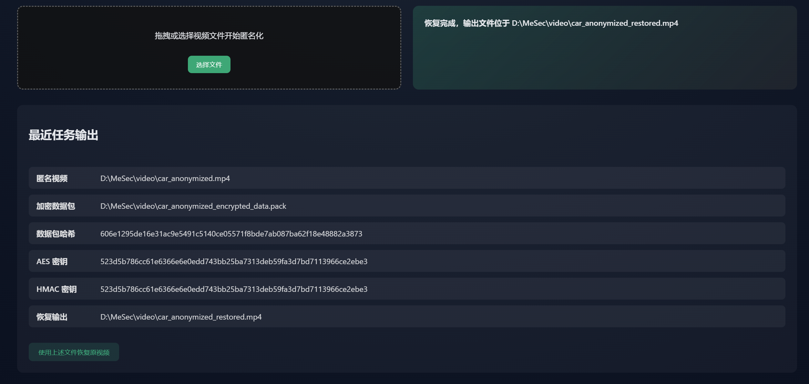

# 可逆视频匿名化桌面应用：编程实践报告（图文版）

> 基于 Electron + Vue 3（前端）与 Python + PyTorch + YOLOv8（后端）的本地桌面应用，聚焦“可逆匿名化”的数字媒体安全实践。

---

## 1. 背景与目标

- 隐私视频处理的挑战：在保护个人隐私（如人脸、车牌）与保留数据可用性之间取得平衡。
- 现状痛点：
  - 不可逆匿名化虽安全，但难以在合规范围内进行后续标注、审计或取证。
  - 纯云端方案存在数据外泄风险与带宽限制。
- 本项目目标：
  - 在本地端实现“高性能 + 可逆”的视频匿名化流程。
  - 统一前端交互与后端计算，保证可用性、可维护性与可扩展性。

---

## 2. 系统概览

- 技术栈：
  - 前端：Electron、Vue 3、Vite、TypeScript
  - 后端：Python（长期驻留子进程）
  - AI/ML：PyTorch、Ultralytics YOLOv8（`yolov8n.pt`）
  - 密码学：AES-256-GCM（机密性与认证），HMAC（完整性校验）
- 关键代码位置（仓库相对路径）：
  - 前端渲染层：`src/renderer/`（UI、路由与组件）
  - 主进程：`src/main/index.ts`（窗口管理、IPC、子进程调度）
  - Python 服务：`scripts/anonymize_service.py`（JSON-RPC、模型常驻、任务分发）
  - 核心流水线：`scripts/video_pipeline.py`（Producer/Workers/Consumer 并行处理）
  - 示例/验证脚本：`scripts/validate_*.py`（旁路检测与验证）

### 2.1 总体架构图（Mermaid）



- 数据产物：
  - 匿名化视频（输出文件）
  - 可逆恢复所需的 `.pack` 元数据文件（含加密 ROI 与必要描述）

---

## 3. 交互与用户体验（UX）

- 关键界面组件：
  - `VideoDropZone.vue`：拖拽/选择视频文件入口，展示基本校验与提示。
  - `ManualRoiDialog.vue`：在视频第一帧框选 ROI，可选启用跟踪，覆盖自动检测结果。
  - `StatusBanner.vue`：展示任务状态（排队、处理中、完成/失败）与处理速率/耗时（如可获取）。
- 用户路径（概览）：

```mermaid
flowchart TD
  U[用户] --> D[拖拽/选择视频]
  D --> O[选择匿名化风格\n(高斯/像素化/马赛克)]
  O --> R[可选: 手动框选 ROI / 启用跟踪]
  R --> S[开始处理]
  S -->|IPC| M[主进程调度]
  M -->|JSON-RPC| PY[Python 服务]
  PY --> OUT[生成匿名视频 + .pack]
  OUT --> UI[UI 更新结果与存储位置]
```

---

## 4. 核心功能实现

### 4.1 自动检测（YOLOv8）
- 启动 Python 服务时加载一次 YOLOv8n 模型，常驻内存复用，避免重复加载开销。
- 支持 CUDA（NVIDIA GPU）或 CPU 两种推理模式，可根据环境自适应/配置。

### 4.2 手动 ROI 与跟踪
- 在第一帧允许用户框选一个或多个 ROI；在处理阶段以此为“种子”，并可结合检测结果进行覆盖或合并。
- 跟踪策略可按需求增强（如多目标一致性 ID、遮挡处理等，当前以简化方案为主）。

### 4.3 多种匿名化风格
- 高斯模糊、像素化、马赛克三种可选风格，对检测/选择出的 ROI 区域进行处理。

### 4.4 可逆加密与数据打包
- 对 ROI 原始内容进行 AES-256-GCM 加密，保留认证标签，确保机密性与抗篡改。
- 生成 `.pack` 文件，记录：帧索引、ROI 区域、随机数（nonce/iv）、加密片段、算法参数等，用于后续恢复。
- 使用 HMAC 对整体数据包进行校验，避免传输或存储过程中被无声篡改。

### 4.5 并行流水线（Producer-Consumer）



- 设计要点：
  - Producer 负责从视频流读取帧，放入队列；多个 Worker 并行处理；Consumer 负责按时间顺序写回。
  - 利用多核 CPU 并行化非 GPU 工作，同时 GPU 侧由模型推理占用，形成整体流水线。
  - 控制队列长度与背压，避免内存暴涨。

### 4.6 前后端通信（时序）



---

## 5. 安全设计与威胁模型

- 保护目标：
  - ROI 机密性（未授权者无法恢复/查看原始内容）。
  - 数据完整性（匿名化输出与 `.pack` 未被悄然篡改）。
  - 可恢复性（持有正确密钥者可按需精准恢复）。
- 信任边界：
  - 本地应用内：Electron（Main/Renderer）与本机 Python 子进程之间通信渠道受本机安全策略约束。
  - 密钥管理：默认由用户负责妥善保管，项目不内置远程 KMS。
- 主要威胁与缓解：
  - `.pack` 篡改/重放 → 通过 AES-256-GCM 的认证与 HMAC 双重校验发现篡改。
  - 密钥泄露 → 建议配合操作系统密钥环/硬件密钥设备；避免明文持久化。
  - 模型误检/漏检 → 允许手动 ROI 覆盖与复核；保留人机协作闭环。
  - 对抗样本/攻击性贴纸 → 可引入置信度阈值、启发式后处理、复检策略。
- 合规思考（示例）：
  - 数据最小化：仅对必要 ROI 做加密与打包；`.pack` 不包含多余个人信息。
  - 可撤回：持有密钥可在授权情形下恢复；无密钥则保持匿名化效果。

---

## 6. 性能工程

- 模型常驻：`scripts/anonymize_service.py` 启动时加载 YOLOv8，一次加载多次复用。
- 并行流水线：Reader/Workers/Consumer 解耦；充分利用多核与 GPU/CPU 混合算力。
- I/O 优化：批量帧缓冲、控制队列深度，降低磁盘抖动与上下文切换。
- 回压与容错：任务排队、可取消；异常帧降级处理，防止整体中断。
- 设备适配：CUDA 优先、CPU 回退；避免因驱动/显卡差异导致整体不可用。

---

## 7. 可维护性与工程实践

- 模块边界清晰：UI（`src/renderer`）、主进程（`src/main/index.ts`）、计算服务（`scripts/*`）。
- 通信契约：IPC/JSON-RPC 负载定义固定，便于版本演进与测试。
- 日志与诊断：任务级日志、错误栈上报到 UI；`scripts/validate_*.py` 便于旁路排查。
- 环境与依赖：
  - Node 侧 `npm install`；Python 侧推荐虚拟环境与 `backend/requirements.txt`。
  - CUDA 环境按 PyTorch 官方指引安装对应版本获得加速能力。

---

## 8. 实践中的问题与取舍

- 可逆性 vs 安全：可逆带来密钥流通与管控成本，需要明确密钥责任与访问流程。
- 匿名强度 vs 画质：模糊/马赛克强度越大越安全，但对可用性有负面影响；建议按场景选择。
- 自动化 vs 人工复核：纯自动化存在误检/漏检，提供手动 ROI 与复核机制可提升可靠性。
- 性能 vs 资源：GPU 加速显著提速，但需兼容无 GPU 环境；流水线并发需与内存/编码器能力平衡。

---

## 9. 个人收获与思考（数字媒体安全）

- 安全不是单点技术，而是端到端流程设计：检测、处理、打包、校验、恢复形成闭环。
- “可逆匿名化”强调责任边界：谁能恢复、何时恢复、如何审计，是技术之外的治理问题。
- 模型不确定性要求人机协作：允许人工覆盖与复核，实用比“绝对自动化”更重要。
- 本地化处理提升可信度：数据不出本机，降低泄露面，但也要求更好的端侧密钥管理实践。
- 工程化让研究落地：常驻进程、并行流水线、契约式通信，才能将算法真正融入产品体验。

---

## 10. 未来工作

- 跟踪与一致性：引入多目标跟踪（ID 保持）、遮挡恢复，减少抖动与漏检。
- 指标与评测：建立匿名强度与可用性双指标体系，完善基准与回归测试。
- 实时与批处理：支持实时摄像头流与批量离线任务队列，提升覆盖场景。
- 密钥管理：集成 OS 密钥环或外部 KMS，支持多租户与审计日志。
- 可视化与可解释：在 UI 中直观展示检测结果、ROI 边界与恢复预览，增强可控性。

---

## 附录 A：插图占位符（请替换为实际截图）

> 建议在完成一次端到端处理后截取以下页面/结果图，并放置于 `docs/img/` 目录，更新下列引用。

- UI 首页与拖拽区域（占位）：

  

- 手动 ROI 对话框（占位）：

  

- 处理完成状态与结果预览（占位）：

  

---

## 附录 B：引用与路径速览

- 主进程：`src/main/index.ts`
- 渲染层入口：`src/renderer/src/main.ts`，页面：`src/renderer/src/views/HomeView.vue`
- 关键组件：`src/renderer/src/components/VideoDropZone.vue`、`ManualRoiDialog.vue`、`StatusBanner.vue`
- Python 服务：`scripts/anonymize_service.py`
- 视频流水线：`scripts/video_pipeline.py`
- 依赖清单：`backend/requirements.txt`
- 模型权重：`yolov8n.pt`（仓库根与 `scripts/` 下各有一份，请按需统一路径）

---

> 注：本报告不包含虚构性能指标；若需基准数据，建议在目标机器（CPU/GPU、内存、磁盘类型）上以固定视频集运行并记录 FPS/耗时与资源占用。
